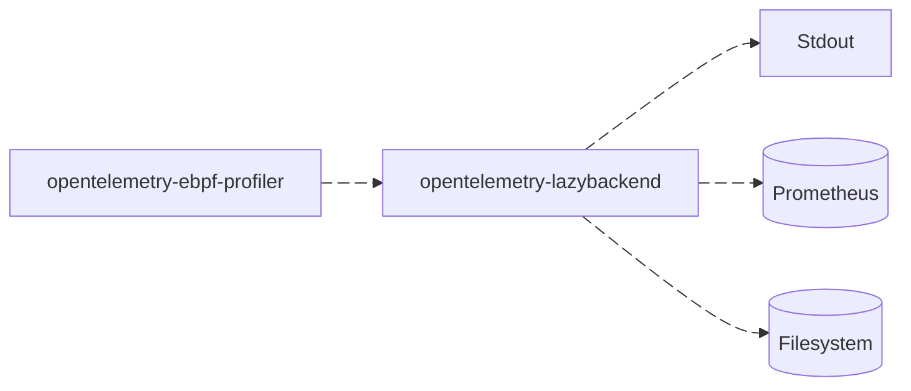
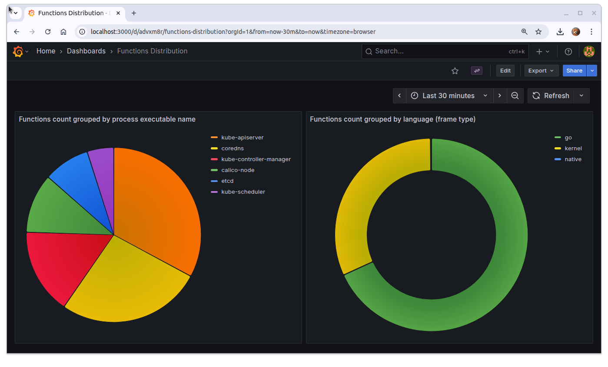

# (WIP) OpenTelemetry Lazy Backend

[](https://github.com/danielpacak/opentelemetry-lazybackend/actions/workflows/publish-container-image.yaml)

The OTel Lazy Backend is not supposed to replace OTel Collector and its components, but is useful to
debug raw OTel signals such as profiles. The main reason it exists is that production-grade backends
that support profiles are not created equal and many of them loose important details or lag behind
the latest profiles definition.



## Installation

### Build from Source

If you have Go installed, clone the repository and build the binary:

```console
git clone https://github.com/danielpacak/opentelemetry-lazybackend.git
cd opentelemetry-lazybackend
go build -o opentelemetry-lazybackend .
```

The resulting `opentelemetry-lazybackend` binary will be in the current directory.

### Install with `go install`

If you have Go installed, you can install the latest version directly:

```console
go install github.com/danielpacak/opentelemetry-lazybackend@latest
```

The binary is placed in `$GOPATH/bin` (typically `~/go/bin`). Make sure that
directory is on your `PATH`:

```console
export PATH="$PATH:$(go env GOPATH)/bin"
```

### Run with Docker

Build a local image for your platform:

```console
docker buildx build --platform=linux/amd64 --load \
  --tag docker.io/danielpacak/opentelemetry-lazybackend:latest .
```

```console
docker buildx build --platform=linux/arm64 --load \
  --tag docker.io/danielpacak/opentelemetry-lazybackend:latest .
```

Or pull and run the pre-built image from Docker Hub:

```console
docker run --rm --name lazybackend -p 4317:4317 -p 4318:4318 -p 2112:2112 \
  docker.io/danielpacak/opentelemetry-lazybackend:latest \
  -grpc-address 0.0.0.0:4317 \
  -http-address 0.0.0.0:4318 \
  -receiver prometheus \
  -prometheus.metrics 0.0.0.0:2112
```

The backend listens for OTLP profiles on two endpoints: gRPC on port `4317`
(`-grpc-address`) and HTTP on port `4318` (`-http-address`). Publish both ports
so producers can reach either listener.

## Quickstart Guide

1. Install the OTel Lazy Backend using one of the methods from the [Installation](#installation)
   section, then start it with the default config to receive profiles and print them to the standard
   output.

   ``` console
   $ ./opentelemetry-lazybackend
   --------------- New Resource Profile --------------
     container.id: 6d7d5c336f79fbfae3e76c4a25b2c3805ffa74ab4c6145d4219ec2b92185fb6f
   ------------------- New Profile -------------------
     ProfileID: 00000000000000000000000000000000
     Time: 2025-09-23 04:55:35.51787723 +0000 UTC
     Duration: 1970-01-01 00:00:02.840298447 +0000 UTC
     PeriodType: [cpu, nanoseconds, Unspecified]
     Period: 50000000
     Dropped attributes count: 0
     SampleType: samples
   ------------------- New Sample --------------------
     Timestamp[0]: 1758603335517877230 (2025-09-23 06:55:35.51787723 +0200 CEST)
     thread.name: etcd
     process.executable.name: etcd
     process.executable.path: /usr/local/bin/etcd
     process.pid: 3086
     thread.id: 11322
   ---------------------------------------------------
   Instrumentation: kernel, Function: do_syscall_64, File: , Line: 0, Column: 0
   Instrumentation: kernel, Function: entry_SYSCALL_64_after_hwframe, File: , Line: 0, Column: 0
   Instrumentation: go, Function: runtime.futex, File: runtime/sys_linux_amd64.s, Line: 558, Column: 0
   Instrumentation: go, Function: runtime.futexsleep, File: runtime/os_linux.go, Line: 69, Column: 0
   Instrumentation: go, Function: runtime.notesleep, File: runtime/lock_futex.go, Line: 171, Column: 0
   Instrumentation: go, Function: runtime.stopm, File: runtime/proc.go, Line: 1762, Column: 0
   Instrumentation: go, Function: runtime.findRunnable, File: runtime/proc.go, Line: 3147, Column: 0
   Instrumentation: go, Function: runtime.schedule, File: runtime/proc.go, Line: 3868, Column: 0
   Instrumentation: go, Function: runtime.park_m, File: runtime/proc.go, Line: 4037, Column: 0
   Instrumentation: go, Function: runtime.mcall, File: runtime/asm_amd64.s, Line: 459, Column: 0
   ------------------- End Sample --------------------
   ------------------- New Sample --------------------
     Timestamp[0]: 1758603337408146688 (2025-09-23 06:55:37.408146688 +0200 CEST)
     Timestamp[1]: 1758603337358132101 (2025-09-23 06:55:37.358132101 +0200 CEST)
     Timestamp[2]: 1758603338358175677 (2025-09-23 06:55:38.358175677 +0200 CEST)
     thread.name: etcd
     process.executable.name: etcd
     process.executable.path: /usr/local/bin/etcd
     process.pid: 3086
     thread.id: 3421
   ---------------------------------------------------
   Instrumentation: go, Function: runtime.pidleget, File: runtime/proc.go, Line: 6569, Column: 0
   Instrumentation: go, Function: runtime.findRunnable, File: runtime/proc.go, Line: 3482, Column: 0
   Instrumentation: go, Function: runtime.schedule, File: runtime/proc.go, Line: 3868, Column: 0
   Instrumentation: go, Function: runtime.park_m, File: runtime/proc.go, Line: 4037, Column: 0
   Instrumentation: go, Function: runtime.mcall, File: runtime/asm_amd64.s, Line: 459, Column: 0
   ------------------- End Sample --------------------
   ------------------- End Profile -------------------
   -------------- End Resource Profile ---------------
   ```

2. In a separate terminal, generate OTel profiles by running the OTel eBPF profiler. Since it has
   not officially been released yet, build it from sources:

   ```console
   git clone git@github.com:open-telemetry/opentelemetry-ebpf-profiler.git
   cd opentelemetry-ebpf-profiler
   make agent
   ```

   :coffee: :coffee: :coffee:

   ```console
   $ sudo ./ebpf-profiler -collection-agent="localhost:4317" -disable-tls -tracers=all -samples-per-second=19
   INFO[0000] Starting OTEL profiling agent v0.0.0 (revision main-69066441, build timestamp 1758215582) 
   INFO[0000] Interpreter tracers: perl,php,python,hotspot,ruby,v8,dotnet,go,labels 
   INFO[0000] Found offsets: task stack 0x20, pt_regs 0x3f58, tpbase 0x2468 
   INFO[0000] Supports generic eBPF map batch operations   
   INFO[0000] Supports LPM trie eBPF map batch operations  
   INFO[0000] eBPF tracer loaded                           
   INFO[0000] Attached tracer program                      
   INFO[0000] Attached sched monitor                       
   ```

3. Optionally, to capture event-based stack traces from a custom kernel or user-space hook, the
   profiler can load a generic eBPF program and attach it to any kprobe or uprobe. For example, to
   trace every `copy_process` call:

   ```console
   $ sudo ./ebpf-profiler -collection-agent="localhost:4317" -disable-tls -tracers=all \
     -load-probe \
     -probe-link=kprobe:copy_process
   ```

   The Lazy Backend will receive `events`-typed profiles instead of the usual `samples`:

   ``` console
   $ ./opentelemetry-lazybackend
   --skip--
   ------------------- New Profile -------------------
     ProfileID: 00000000000000000000000000000000
     Time: 2026-05-06 11:35:25.372004042 +0000 UTC
     Duration: 4790449180
     PeriodType: [, ]
     Period: 0
     Dropped attributes count: 0
     SampleType: events
   ------------------- New Sample --------------------
     Timestamp[0]: 1778067329629468959 (2026-05-06 13:35:29.629468959 +0200 CEST)
     thread.name: langflow
     thread.id: 91228
     cpu.logical_number: 5
   ---------------------------------------------------
   Instrumentation: kernel, Function: copy_process, File: , Line: 0, Column: 0
   Instrumentation: kernel, Function: __x64_sys_vfork, File: , Line: 0, Column: 0
   Instrumentation: kernel, Function: x64_sys_call, File: , Line: 0, Column: 0
   Instrumentation: kernel, Function: do_syscall_64, File: , Line: 0, Column: 0
   Instrumentation: kernel, Function: entry_SYSCALL_64_after_hwframe, File: , Line: 0, Column: 0
   Instrumentation: native: Function: 0xd4377, File: libc.so.6
   Instrumentation: native: Function: 0x2c91, File: _posixsubprocess.cpython-312-x86_64-linux-gnu.so
   Instrumentation: native: Function: 0x34a3, File: _posixsubprocess.cpython-312-x86_64-linux-gnu.so
   Instrumentation: native: Function: 0x38d7, File: _posixsubprocess.cpython-312-x86_64-linux-gnu.so
   Instrumentation: cpython, Function: Popen._execute_child, File: /usr/local/lib/python3.12/subprocess.py, Line: 1884, Column: 0
   Instrumentation: cpython, Function: Popen.__init__, File: /usr/local/lib/python3.12/subprocess.py, Line: 1026, Column: 0
   Instrumentation: cpython, Function: <interpreter trampoline>, File: <shim>, Line: 1, Column: 0
   Instrumentation: native: Function: 0x23dca7, File: libpython3.12.so.1.0
   --skip--
   ```

## Command-Line Flags

The backend is configured with the following flags:

| Flag              | Default          | Description                                                       |
|-------------------|------------------|-------------------------------------------------------------------|
| `-grpc-address`   | `0.0.0.0:4317`   | gRPC listen address (`host:port`).                                |
| `-http-address`   | `0.0.0.0:4318`   | HTTP listen address (`host:port`).                                |
| `-receiver`       | `stdout`         | Profiles receiver to use: `stdout`, `prometheus`, or `filesystem`. |
| `-prometheus.metrics` | `127.0.0.1:2112` | Prometheus metrics listen address (`host:port`). Only used with `-receiver prometheus`. |
| `-filesystem.dir` | `profiles`       | Output directory for the `filesystem` receiver.                   |
| `-filesystem.container-id` | _(empty)_ | If set, the `filesystem` receiver only processes profiles with this `container.id`. |

The `-receiver` flag selects which receiver processes incoming profiles. Use
`stdout` to print profiles to the standard output (the default), `prometheus`
to expose aggregated stats on the metrics endpoint, or `filesystem` to persist
profiles to disk:

```
./opentelemetry-lazybackend -receiver prometheus
```

Receiver-specific options are namespaced as `-<receiver>.<option>` (e.g.
`-prometheus.metrics`, `-filesystem.dir`) so they are only meaningful for the
matching receiver.

## Receivers

### Stdout Receiver

The default receiver. Prints each incoming profile to standard output in a
human-readable text format, including resource attributes, profile metadata,
per-sample timestamps and attributes, and the full stack trace with
instrumentation type, function name, file, and line number.

```
./opentelemetry-lazybackend -receiver stdout
```

### Filesystem Receiver

Writes each received stack trace as a JSON file, grouped by `container.id` and
separated by sample type (CPU `samples` vs event-based `events`):

```
<filesystem.dir>/<container.id>/<sample-type>/<n>.json
```

For example, with `-receiver filesystem -filesystem.dir profiles`:

```
profiles/6d7d5c33.../samples/1.json
profiles/6d7d5c33.../events/1.json
```

To capture stack traces from a single pod or container only, pass its
`container.id` so everything else is ignored:

```
./opentelemetry-lazybackend -receiver filesystem -filesystem.container-id 6d7d5c33...
```

File numbering continues after any files already present, so restarts do not
overwrite earlier output. Each JSON file represents a single stack trace with
its timestamps, attributes, and frames:

``` json
{
  "container_id": "6d7d5c33...",
  "profile_id": "00000000000000000000000000000000",
  "sample_type": "samples",
  "timestamps_unix_nano": [1758603335517877230],
  "attributes": {
    "thread.name": "etcd",
    "process.executable.name": "etcd"
  },
  "frames": [
    { "type": "kernel", "function": "do_syscall_64", "file": "sys.c", "line": 42 }
  ]
}
```

### Prometheus Receiver

Exposes aggregated stats about received profiles, stack traces, and functions on
the `/metrics` endpoint. For example, the following Grafana dashboard shows the
distribution of functions grouped by process executable name and language
(= frame type).



## Similar Projects

Notice that the OTel Debug Exporter supports profiles, but is pretty useless because it dumps symbol
tables separated from stack traces, which makes it too verbose and hard to read.
